+++
title = ""
author = "Shuhei, Kawamura"
date = ""
tags = []
categories = []
draft = "true"
+++

# はじめに

こちらの記事は、[Oracle Cloud Infrastructure Advent Calendar 2021](https://qiita.com/advent-calendar/2021/oci) Day X の記事として書かれています。
今回は、10 月後半に全機能が揃った [OCI DevOps](https://docs.oracle.com/ja-jp/iaas/Content/devops/using/home.htm) に関する記事です。（内容はほとんど変わらないと思いますが）OKE の方はきっと誰かが書いてくれることを願って私の方では Oracle Functions に特化した内容で書きたいと思います。内容が結構ボリューミーになりそうなので全 2 回に分けたいと思います。

1. 事前準備編
2. **ビルド、デプロイメント・パイプライン作成編** ← 本記事はこれ

# 今回作る環境

全 2 回を通してこのような環境を作ってみます。

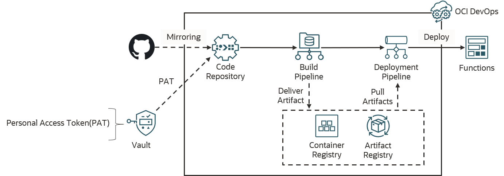

ソースコード本体は、機能（Issue, Wiki, etc.）が充実している GitHub, GitLab で管理し、OCI へデプロイするためにソースコードを Code Repository へミラーリングするよくありそうなパターンです。

# 実際に作ってみる

## 前提

- [1 回目のリンク](http://localhost:8080)が完了していること

## ビルド・パイプライン

GitHub からのミラーリングの設定 ~ OCIR[^1] に Oracle Functions の Docker Image を push する所までを作っていきます。図で表すと以下の赤線の箇所を作成していきます。

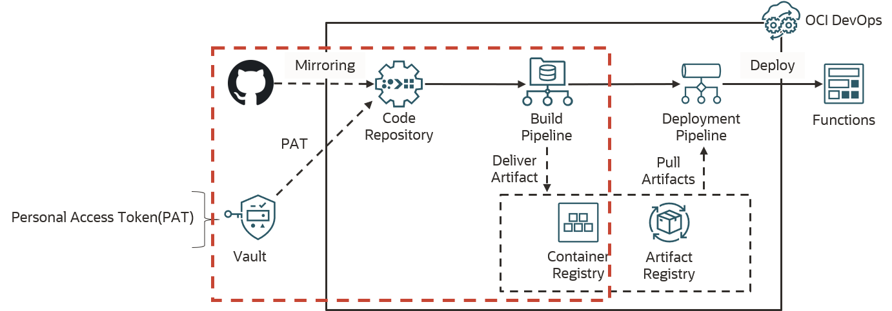

[^1]: Oracle Container Infrastructure Refistry

### 外部接続の定義

まずは、GitHub → Code Repository に対するミラーリングの設定を行うための接続定義を行います。OCI コンソール左上のハンバーガーメニューから**開発者サービス** > **プロジェクト**と選択します。

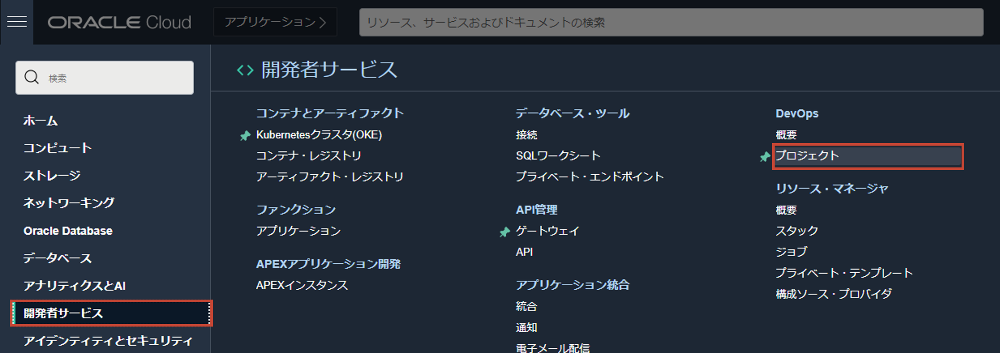

先ほど、作成した DevOps のプロジェクトの詳細画面から**外部接続**を選択します。

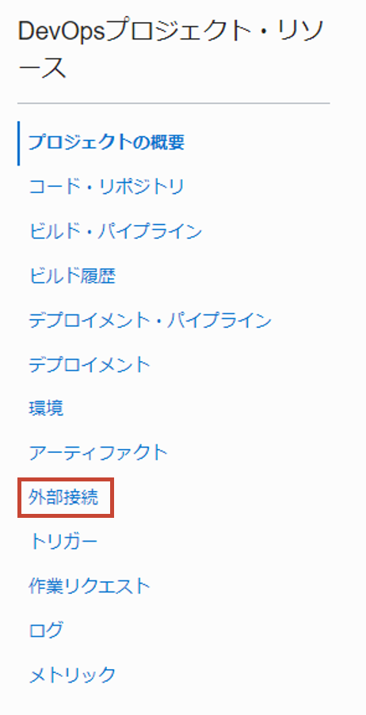

**外部接続の作成**を押し、以下のように入力して外部接続を新しく定義します。

- 名前: github-connection
- タイプ: GitHub
- ボールト・シークレット
  - ボールト: 作成済みの Vault(GitHub の PAT が格納されている Vault を選択する)
  - シークレット: GitHub の PAT

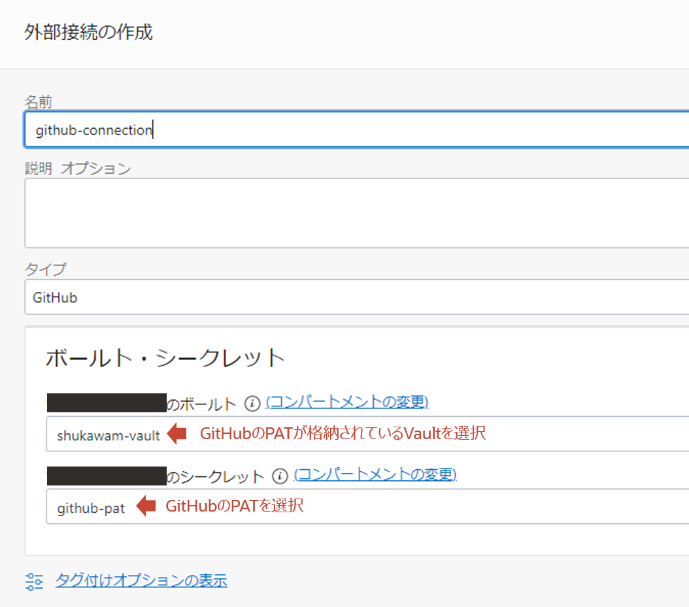

これで、ミラーリングのための外部接続設定は完了です。

### リポジトリのミラーリング設定

ミラーリングの設定を行います。作成済みの DevOps プロジェクトの詳細画面から**コード・リポジトリ**を選択します。

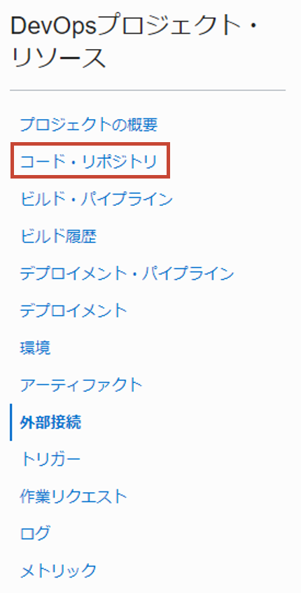

**リポジトリのミラー化**を選択します。


以下のように入力して、ミラー先のリポジトリを定義します。

- 接続: github-connection
- リポジトリ: fn-examples
- ミラーリング・スケジュール
  - スケジュール・タイプ: カスタム
  - ミラーリング間隔: 15 分(最短 1 分から設定可能なので、お好きな値に設定してください)
- 名前: github_fn-examples

これで、ミラー先のリポジトリの作成が完了です。

### build_spec.yaml の作成

いよいよ、ビルドを行うための設定ファイルを書いていきます。build_spec.yaml の仕様に関しては [OCI Document - ビルド指定](https://docs.oracle.com/ja-jp/iaas/Content/devops/using/build_specs.htm)をご参照ください。今回は、以下のような設定ファイルを `fn-examples/fn-hello/`に配置します。

```build_spec.yaml
# https://docs.oracle.com/ja-jp/iaas/Content/devops/using/build_specs.htm
# build runner config
version: 0.1
component: build
timeoutInSeconds: 10000
shell: bash
env: # ... 1
  variables:
    docker_username: <namespace>/oracleidentitycloudservice/<your-email>
    docker_server: nrt.ocir.io
    repository_path: <namespace>/devops/fn-hello
    function_name: fn-hello
    function_version: 0.0.1
  vaultVariables:
    docker_password: ocid1.vaultsecret.oc1.ap-tokyo-1...
  exportedVariables:
    - tag

# steps
steps:
  - type: Command
    name: "Login to OCIR"
    timeoutInSeconds: 60
    command: |
      docker login ${docker_server} -u ${docker_username} -p ${docker_password}
    onFailure:
      - type: Command
        command: |
          echo "Failure successfully handled"
        timeoutInSeconds: 60
  - type: Command # ... 2
    name: "Docker image build"
    timeoutInSeconds: 4000
    command: |
      cd fn-hello
      fn build
      docker tag ${function_name}:${function_version} ${docker_server}/${registry_path}:latest
      tag=${function_version}
    onFailure:
      - type: Command
        command: |
          echo "Failure successfully handled"
        timeoutInSeconds: 60

outputArtifacts: # ... 3
  - name: fn-hello-image
    type: DOCKER_IMAGE
    location: nrt.ocir.io/<namespace>/devops/fn-hello:latest
```

いくつか、ポイントがあるので簡単に補足します。

1. パイプライン中に使用する変数を定義しています。
   - variables(パイプライン中に使用する変数)
     - docker_username: OCIR へログインする際のユーザー名を定義します
       - ※\<namespace\>, \<your-email\>はご自身のものに修正してください
     - docker_server: OCIR にログインする際に指定するサーバー名
       - \<region-key\>.ocir.io の形式で指定します
       - 詳細は、[Oracle Cloud Infrastructure Registry へのログイン](https://docs.oracle.com/ja-jp/iaas/Content/Functions/Tasks/functionslogintoocir.htm)をご参照ください
     - repository_path: OCIR に作成したリポジトリのパス
     - function_name: 作成した関数名（fn-hello）
     - function_version: func.yaml に記載のある関数のバージョン
   - vaultVariables(OCI Vault から参照する変数)
     - OCIR のパスワードを格納したシークレットの OCID を指定します
   - exportedVariables(後続のステージに渡す変数を定義)
     - tag: 実際に OCIR に push されるときの Docker Image のバージョン
2. Docker Image のビルドを Fn CLI のビルドオプション（`fn build`）を用いて実施しています。また、作成される Docker Image は今回の場合だと `fn-hello:v0.0.1` という名前が付けられているので、それを `docker tag ...` で `nrt.ocir.io/<namespace>/devops/fn-hello:latest` に変更しています。次に、実際に push する際のバージョンを `tag=${function_version}`で設定します。（単純に Commit Hash(`${OCI_TRIGGER_COMMIT_HASH}`)を使うのでも良いと思います。）
3. 次のステージ（アーティファクトの配信）で使うためのアーティファクトを指定します。

作成した build_spec.yaml は GitHub に push しておきます。

```bash
# ./fn-examples
git add fn-hello/build_spec.yaml
```

```bash
git commit -m "Added build_spec.yaml"
```

```bash
git push origin main
```

### ビルド・パイプラインの作成

前工程で作成した build_spec.yaml を実際に適用するビルド・パイプラインを作成していきます。作成済みの DevOps プロジェクトの詳細画面から**ビルド・パイプライン**を選択します。

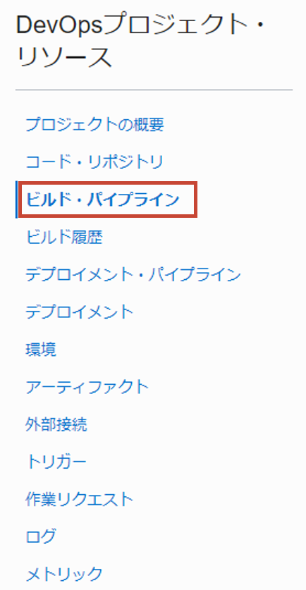

**ビルド・パイプラインの作成**をクリックし、以下のように入力しビルド・パイプラインを新規に作成します。

- 名前: fn-hello-build-pipeline

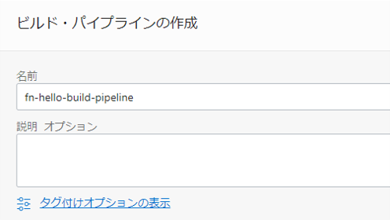

作成したビルド・パイプラインの詳細画面で**ステージの追加**を押し、新規にステージを作成します。

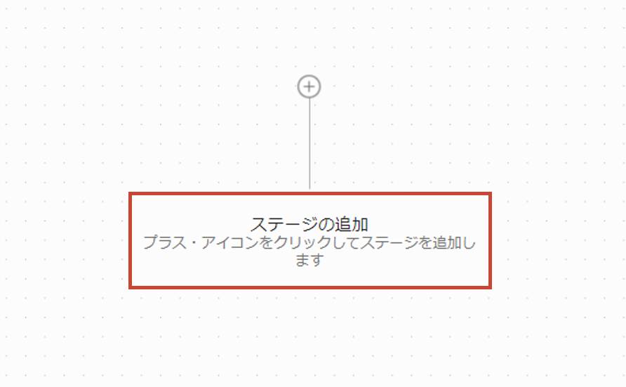

ステージ・タイプの選択で**マネージド・ビルド**を選択し、**次**を押します。

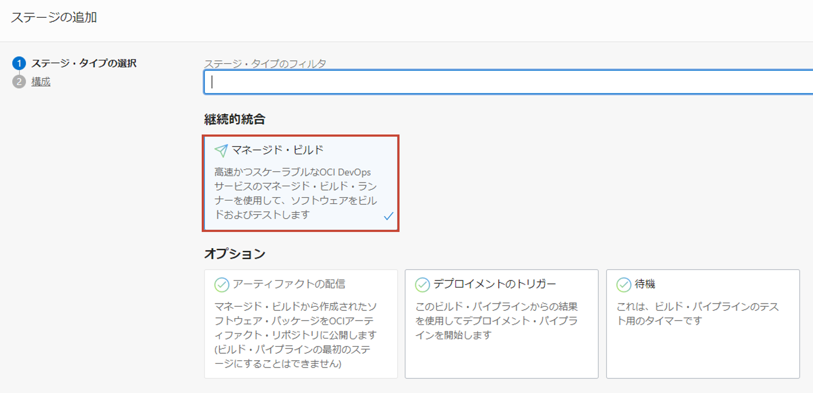

以下のように入力し、ビルド・ステージを追加します。

- ステージ名: build_stage
- ビルド指定ファイル・パス: fn-hello/build_spec.yaml
- プライマリ・コード・リポジトリ
  - ソース: 接続タイプ: github_fn-examples
  - ブランチの選択: main
  - ソース名の作成: fn-hello

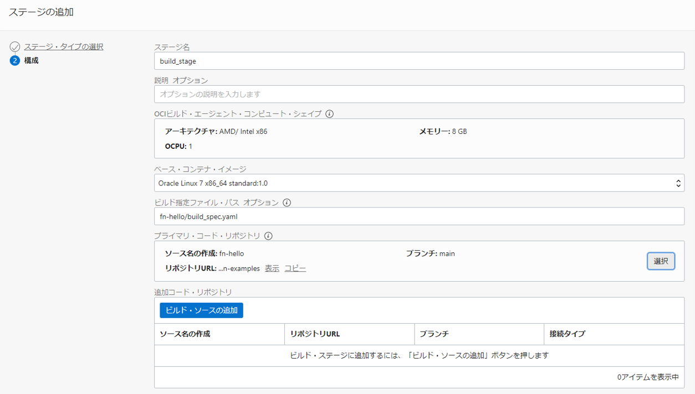

次に、build_stage で生成し outputArtifact として出力した Oracle Functions の Docker Image を OCIR へプッシュするステージを作成します。build_stage 下の"+"アイコンをクリックし、ステージの追加を選択します。

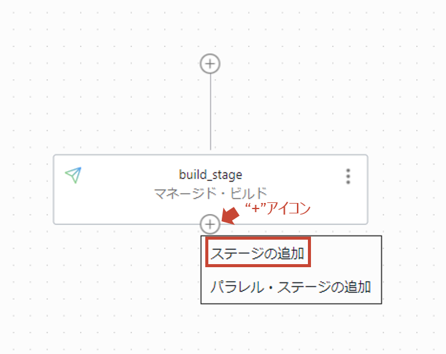

ステージ・タイプとして**アーティファクトの配信**を選択します。

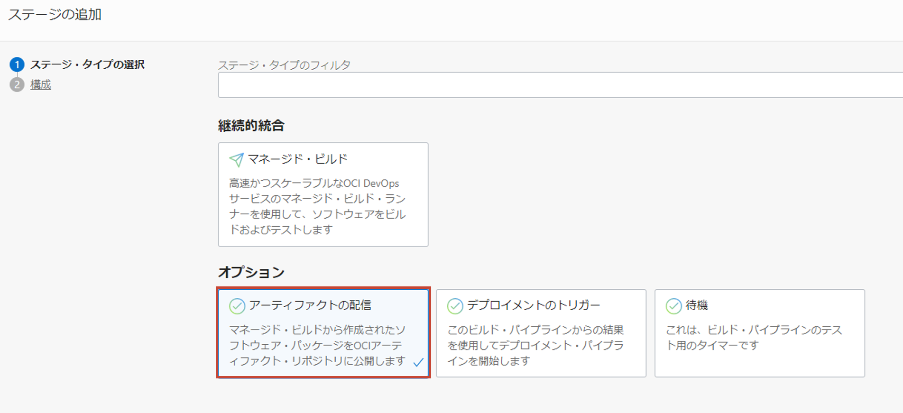

以下のように入力します。

- ステージ名: image_push
- アーティファクトの作成を選択
  - 名前: fn-hello-image
  - タイプ: コンテナ・イメージ・リポジトリ
  - コンテナ・レジストリへの完全修飾パス: \<region-code\>.ocir.io/\<namespace\>/devops/fn-hello:${tag}
  - このアーティファクトで使用するパラメータの置き換え: はい、プレースホルダーを置き換えます

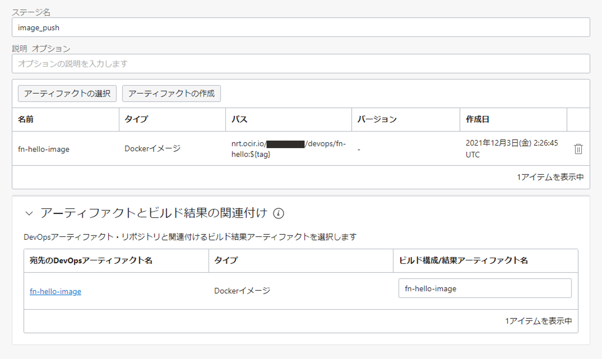

これで、ビルドパイプラインが起動された際に Oralce Functions の Docker Image の作成と OCIR へプッシュを行うビルド・パイプラインが作成できました。

### トリガーの設定

作成したビルド・パイプラインを起動するためのトリガーを作成します。作成済みの DevOps プロジェクトの詳細画面から**トリガー**を選択します。

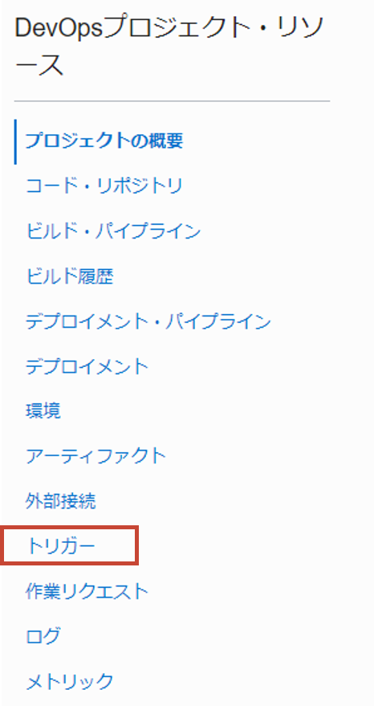

**トリガーの作成**を押し、以下のように入力します。

- 名前: fn-hello-trigger
- ソース接続: OCI コード・リポジトリ
- コード・リポジトリの選択: github_fn-examples
- アクションの追加
  - ビルド・パイプラインの選択: fn-hello-build-pipeline
  - イベント: プッシュにチェックを入れる

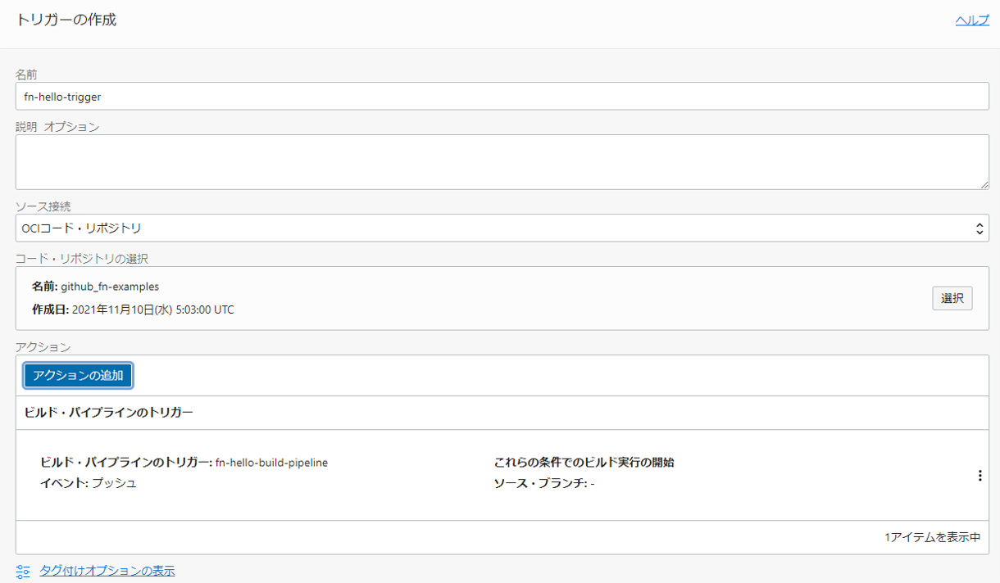

これで、GitHub へソースコードの変更を push し OCI の Code Repository と同期がとられたタイミングで作成したビルド・パイプラインが動作するところまで作成することが出来ました。


## デプロイメント・パイプライン

いよいよ、ビルド・パイプラインで作成した Docker Image を Oracle Functions へデプロイするパイプラインを作成していきます。図で表すと以下の赤線の箇所を作成していきます。

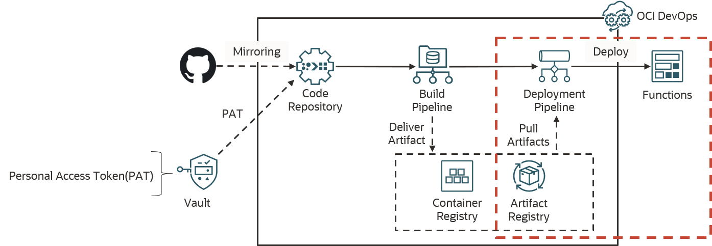

### 環境の作成

まずは、デプロイ先の環境を定義します。作成済みの DevOps プロジェクトの詳細画面から**環境**を選択します。

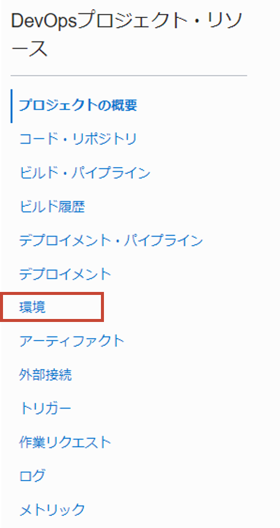

**環境の作成**を押し、以下のように入力します。

- 環境タイプ: ファンクション
- 名前: fn-hello-env

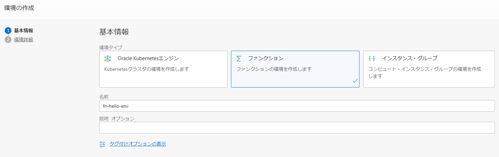

環境詳細で以下のように入力します。

- リージョン: 自分がリソースを配置するリージョンを選択
- コンパートメント: 自分がリソースを配置するコンパートメントを選択
- アプリケーション: devops-app
- ファンクション: fn-hello

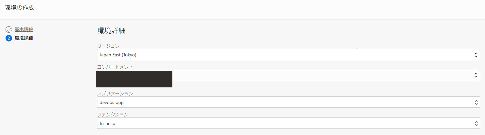

### デプロイメント・パイプラインの作成

定義した環境にデプロイするためのパイプラインを作成します。作成済みの DevOps プロジェクトの詳細画面から**デプロイメント・パイプライン**を選択します。

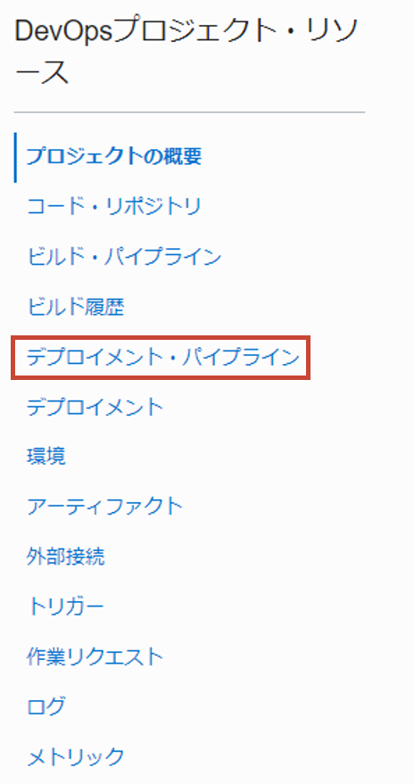

**パイプラインの作成**を押し、以下のように入力します。

- パイプライン名: fn-hello-deploy-pipeline

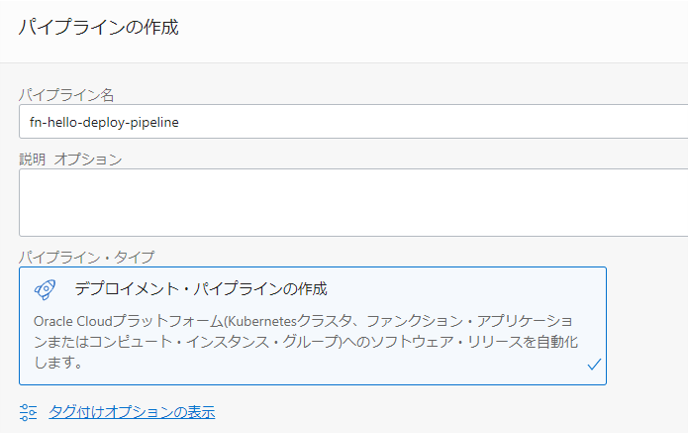

**ステージの追加**を押します。

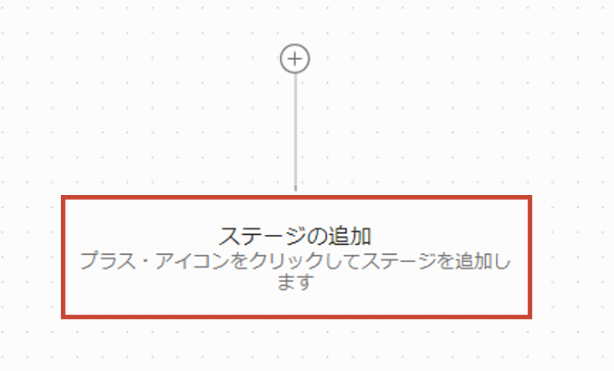

タイプとして、ファンクション用のステージを選択します。

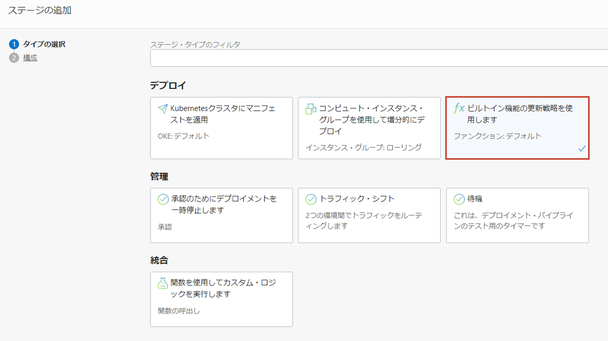

以下のように入力します。

- ステージ名: deploy_stage
- 環境: fn-hello-env
- アーティファクトの選択から、fn-hello-image を選択します

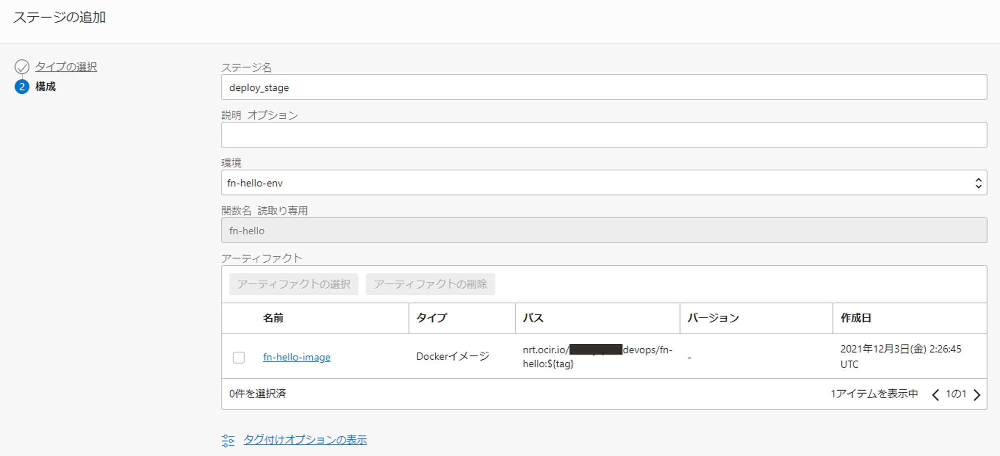

これで、デプロイメント・パイプラインの作成は完了です。

### ビルド・パイプラインの連携設定

最後に、作成したビルド・パイプラインとデプロイメント・パイプラインを連携させます。作成済みの DevOps プロジェクトの詳細画面から**ビルド・パイプライン**を選択します。


先ほどの手順で作成した **fn-hello-build-pipeline** を選択します。image_push の下の"+"アイコンを押します。

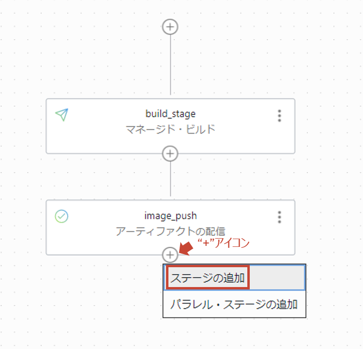

ステージの選択で**デプロイメントのトリガー**を選択します。

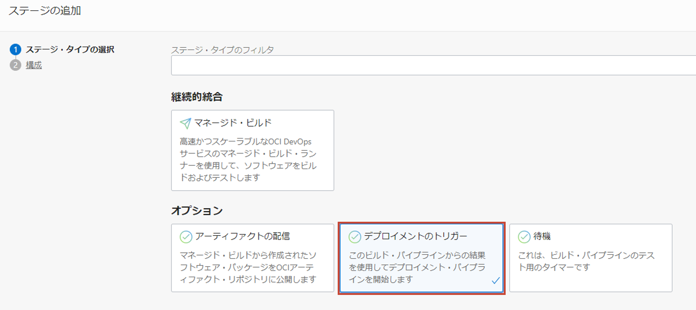

以下のように入力します。

- ステージ名: deploy_stage
- デプロイメント・パイプラインの選択を押し、作成済みの fn-hello-deploy-pipeline を選択します。

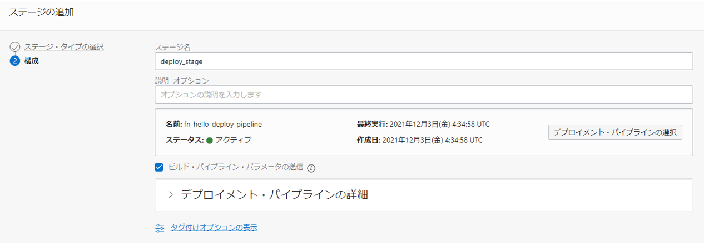

最終的に以下のような状態になっていればパイプライン作成は完了です！

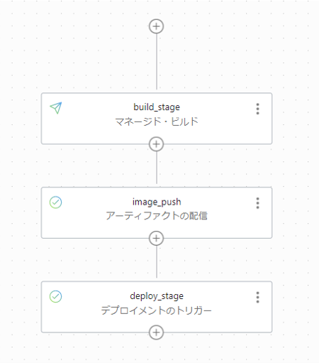

## 実際に動かしてみる

今回は、手動で実行します。ビルド・パイプラインから**手動実行の開始**をクリックします。

しばらく時間が経過すると、パイプラインの実行が成功したことが確認できます。

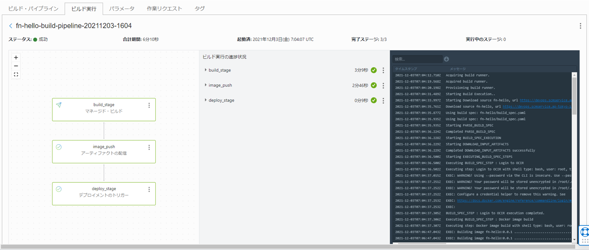

また、OCIR にて build_spec.yaml で設定した`${tag}`のイメージが生成されていることからも確認できます。

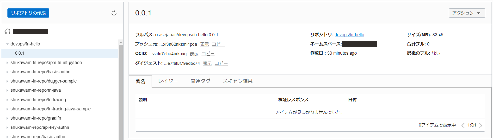

# 終わりに

OCI Native な CI/CD サービスが全て揃ったので、さらに開発体験が良くなりますね！是非試してみてください！

# 参考

- [DevOps ドキュメント](https://docs.oracle.com/ja-jp/iaas/Content/devops/using/home.htm)
