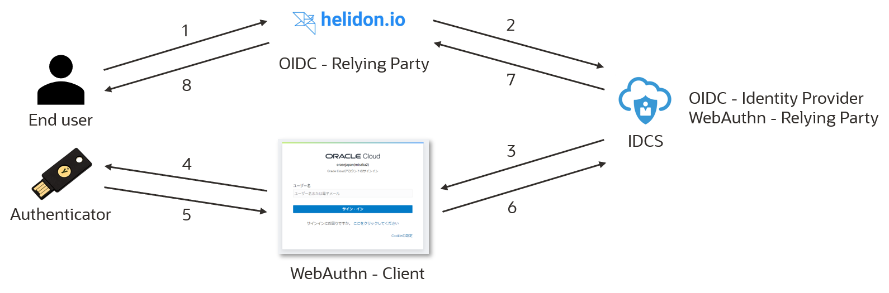

+++
title = ""
author = "Shuhei, Kawamura"
date = ""
tags = []
categories = []
draft = "true"
[[images]]
  src = ""
  alt = ""
  stretch = "stretchH"
+++

# 始めに

FIDO2 による認証を Oracle の IDaaS である IDCS(Oracle Identity Cloud Service)を使ってさくっと作ってみます。

# 全体像

今回作成する環境と流れの概要は以下のようになっています。



簡単に説明すると、

1. OpenID Connect 開始
2. [Helidon](https://oracle-japan-oss-docs.github.io/helidon/docs/v2/#/about/01_overview)で作成した OpenID Connect - Relying Party から IDCS に対して認証リクエストが発行されます
3. 認証画面が返却されます
4. End user の認証が行われます。OpenID Connect では End user の認証方法は特に規定されていませんが、今回は FIDO 認証で実施します
5. `navigator.credentials.get()`の実行結果が Client に対して返却されます
6. Client から WebAuthn - Relying Party に対して認証器が生成した情報を渡します
7. 認証器が生成した情報の検証を行い、結果が正しければ ID トークン(と、アクセストークン)を OpenID Connect - Relying Party である Helidon のアプリケーションへ返却します
8. 認証済みのユーザー名を返却します

という流れになっています。この流れのうち、実際に実装する必要があるのは、1, 8 のみとなっており残りのフローは Helidon の Security Provider(OIDCProvider)が隠蔽していたり、IDCS の設定レベルで実現可能です。また、手元に認証器を持っていない方は、Chrome の拡張である[Virtual Authenticators Tab](https://github.com/google/virtual-authenticators-tab) で代用可能です。

# 構築手順

## IDCS のセットアップ

ここでは、IDCS を

- OpenID Connect の Identity Provider
- WebAuthn の Relying Party

として、設定していきます。

### 事前準備

実際に認証を行うユーザーやそれが属するグループを作成していきます。

#### ユーザーが属する Group を作成する

まずは、ユーザーが属するグループを作成します。作成しなくても実施可能ですが、ポリシーをまとめて適用出来たり何かと便利なので作成しておくことを推奨します。管理コンソールから、**グループ** > **追加**を押下し、グループを新しく作成します。


以下のように入力してグループを作成します。

- 名前: FIDO_GROUP
- 説明: For FIDO Authentication.


現時点では、ユーザーを所属させる必要はないので、このまま**終了**を押し、グループの作成を完了させます。

#### ユーザーの登録とグループへの割り当て

先ほど、作成したグループに所属させるユーザーを作成します。管理コンソールから、**ユーザー** > **追加**を押下し、ユーザーを新しく作成します。


以下のように入力してユーザーを作成します。

- 姓: test
- ユーザー名: test
- 電子メール: your mail address
- ユーザー名として電子メール・アドレスを使用のチェックを外す


**次**をクリックし、[ユーザーが属する Group を作成する](####ユーザーが属する-group-を作成する)で作成したグループ(`FIDO_GROUP`)を割り当てます。


**終了**を押し、ユーザーの作成およびグループへの割り当てを完了させます。

### アプリケーション を作成する

ID 管理を行う単位であるアプリケーションを作成します。管理コンソールから、**アプリケーション** > **追加**を押し、アプリケーションを作成します。


**機密アプリケーション**を選択します。


その後、以下のように入力しアプリケーションを作成します。(記載のない内容については未入力で大丈夫です)

- 詳細
  - 名前: FIDO


- クライアント
  - このアプリケーションをクライアントとして今すぐ構成しますにチェック
  - 許可される権限付与タイプ: JWT アサーション、認可コード
  - HTTPS 以外の URL を許可にチェック
  - リダイレクト URL: `http://localhost:7987/oidc/redirect`
    - Helidon の Security Provider(OIDCProvider)で設定されているデフォルトのリダイレクト URL です
  - Identity Cloud Service 管理 API へのクライアント・アクセス権を付与します: Authenticator Client, Me, MFA Client, Signin


### IDP ポリシーを作成する

アプリケーションに設定する ID 管理のためのポリシー(ユーザーの認証方法等を規定するポリシー)を設定します。管理コンソールから、**セキュリティ** > **IDP ポリシー** > **追加**を押し、FIDO 認証のためのポリシーを作成します。


以下のように入力します。

- ポリシー名: FidoPolicy


次に実際に適用されるルールの設定をします。

- ルール名: fido-rule
- これらのグループのメンバーである: `FIDO_GROUP`(先ほど作成したグループ名を指定する)
- 許可されたアイデンティ・プロバイダ: Username-Password, Fido Authenticator


認証器の登録時に FIDO 認証以外の方法でエンドユーザーを認証する必要があるため、FIDO 認証以外の認証方法も割り当てる必要があります。
そして、先ほど作成したアプリケーションに IDP ポリシーを割り当てます。


### サインオン・ポリシーを作成する

アプリケーションに設定するユーザーの認証時のポリシーを設定します。今回は、

- Username/Password を用いて認証したユーザーに対しては、2 番目の要素として FIDO 認証器による認証を強制する
- FIDO の認証器を用いて認証したユーザーはそのまま認証可能(パスワードレス)

というポリシーを設定したいと思います。**セキュリティ** > **サインオン・ポリシー** > **追加**を押し、サインオン・ポリシーを追加します。


以下のように入力します。

- ポリシー名: FidoPolicy


次に適用するポリシーを以下のように設定します。

- ルール名: fido-rule
- ユーザーが次によって認証されている場合: Username-Password
  - Fido Authenticator も選択すると認証成功 → 再認証の無限ループとなります
- ユーザーのクライアント IP アドレス: すべての場所


- アクセス: 許可
- 追加ファクタの要求にチェック
- 特定のファクタにチェック(FIDO オーセンティケータを選択)
- 登録: 必須


これで、

- Username/Password を用いて認証したユーザーに対しては、2 番目の要素として FIDO 認証器による認証を強制する
- FIDO の認証器を用いて認証したユーザーは追加の要素を要求されずに認証が完了する

といったサインオン・ポリシーを設定できました。

### セッション設定

デフォルトの IDCS の 認証フローでは、Username/Password の確認後に追加の要素があればそれを要求するようなフローとなっていますが、FIDO2 によるパスワードレス認証を有効にするため、**設定** > **セッション設定**から**ユーザー名を先に有効化**のフラグを有効化します。これにより、パスワードの入力前に代替の認証手段(今回だと FIDO 認証器を使用した認証方法)を選択することができるようになります。


### (参考) WebAuthn - Relying Party の設定

WebAuthn - Relying Party に求められることは

- `navigator.credentials.get()/create()` の実行に必要な challenge 等のパラメータのうち、サーバサイドで生成する必要のあるパラメータを生成し、WebAuthn - Client に渡す
- 認証器が生成した情報を適切に検証する

となっています。IDCS では、`navigator.credentials.get()/create()`の実行に必要なパラメータに対してある程度設定することができます。管理コンソールから、**セキュリティ** > **ファクタ** > **FIDO オーセンティケータ**と押すと、この設定を確認することができます。各パラメータに対して簡単な補足を加えたので、設定時の参考にしてください。

| 項目                                 | 概要                                                       | 補足                                                              |
| ------------------------------------ | ---------------------------------------------------------- | ----------------------------------------------------------------- |
| タイムアウト                         | ユーザーが認証器に対してアクションを実行するための時間     |
|                                      |
| アテステーション                     | 認証器の妥当性確認に使用するパラメータの渡し方             | 現在(2021/09/18)はサポートされていません(`NONE`のみ対応)          |
| オーセンティケータ選択アタッチメント | 登録時に使用できる認証器のタイプ                           |                                                                   |
| オーセンティケータ選択ユーザー検証   | ResidentKey のサポート有無を選択できます                   |                                                                   |
| 公開キー・タイプ                     | 鍵ペア生成時に使用するアルゴリズムを選択できます           | 現在(2021/09/18)は、`ES256`, `RS1`, `RS256`のみサポートしています |
| 資格証明の除外                       | ユーザーに紐づく同一認証器の二重登録を防ぐためのパラメータ |                                                                   |

## OpenID Connect - Relying Party を実装する

今回は、[Helidon](https://helidon.io/#/) の Security Provider(OIDCProvider) を使用して OpenID Connect - Relying Party を実装します。と、言ってもほぼ設定レベルのみで認可コードフロー周りの世話や ID トークンの検証を実施してくれるので、そんなに解説することがありませんが...

### 依存関係を追加

Helidon から各種認証プロトコルに対応するためのプロバイダーが提供されているので、そちらを使用するために以下の依存関係を追加します。

```pom.xml
<dependencies>
  <!-- ... -->
  <dependency>
      <groupId>io.helidon.microprofile</groupId>
      <artifactId>helidon-microprofile-oidc</artifactId>
  </dependency>
  <dependency>
      <groupId>io.helidon.security.providers</groupId>
      <artifactId>helidon-security-providers-idcs-mapper</artifactId>
  </dependency>
</dependencies>
```

### 設定ファイル(`application.yaml`)

Security Provider 用の設定を追加します。ドキュメントだとこの辺りに記載されています。

- [Helidon Security Provider - OIDC プロバイダ](https://oracle-japan-oss-docs.github.io/helidon/docs/v2/#/mp/security/02_providers#_oidc_provider)

```application.yaml
security:
  # Set to true for production - if set to true, clear text passwords will cause failure
  config.require-encryption: false
  properties:
    # Recommend: Override with environment value
    idcs-uri: "https://idcs-....identity.oraclecloud.com" # your idcs tenant uri
    idcs-client-id: "1d..." # your client id
    idcs-client-secret: "78..." # your client secret
    frontend-uri: "http://localhost:7987"
    proxy-host: ""
  providers:
    - abac:
      # Adds ABAC Provider - it does not require any configuration
    - oidc:
        client-id: "${security.properties.idcs-client-id}"
        client-secret: "${security.properties.idcs-client-secret}"
        identity-uri: "${security.properties.idcs-uri}"
        # A prefix used for custom scopes
        scope-audience: "http://localhost:7987"
        proxy-host: "${security.properties.proxy-host}"
        frontend-uri: "${security.properties.frontend-uri}"
        audience: "https://idcs-....identity.oraclecloud.com:443"
        # support for non-public signature JWK (and maybe other IDCS specific handling)
        server-type: "idcs"
        idcs-roles: true
    # IDCSのグループを使用してJAX-RSのエンドポイントにRBACを実施する場合は以下が必要
    - idcs-role-mapper:
        multitenant: false
        oidc-config:
          # we must repeat IDCS configuration, as in this case
          # IDCS serves both as open ID connect authenticator and
          # as a role mapper. Using minimal configuration here
          client-id: "${security.properties.idcs-client-id}"
          client-secret: "${security.properties.idcs-client-secret}"
          identity-uri: "${security.properties.idcs-uri}"
```

### ログイン処理を行うためのエンドポイントを作成する

```AuthResource.java
import io.helidon.security.SecurityContext;
import io.helidon.security.annotations.Authenticated;

import javax.json.Json;
import javax.json.JsonBuilderFactory;
import javax.json.JsonObject;
import javax.ws.rs.GET;
import javax.ws.rs.Path;
import javax.ws.rs.Produces;
import javax.ws.rs.core.Context;
import javax.ws.rs.core.MediaType;
import java.util.Collections;

@Path("auth")
public class AuthResource {
    private static final JsonBuilderFactory JSON = Json.createBuilderFactory(Collections.emptyMap());

    @GET
    @Path("login")
    @Authenticated // Helidon - Security Providerを使用して認証処理を行うためのアノテーション
    @Produces(MediaType.APPLICATION_JSON)
    public JsonObject login(@Context SecurityContext securityContext) {
        var message = String.format("Hello %s!", securityContext.userName());
        return JSON.createObjectBuilder()
                .add("message", message)
                .build();
    }
}
```

後は、`http://localhost:<your-port>/auth/login`をブラウザから叩けば、FIDO2 + OIDC の認証処理を行われます。

# 終わりに

初めて触る方にとっては、想像したよりも簡単に FIDO 認証を導入することができたのではないでしょうか。今回は、**Identity Provider が WebAuthn の Relying Party を代わりに実装している**形式で試してみましたが、学習がてら自分で実装してみたい方はこちらも参考にしてみてください。

[Helidon MP, WebAuthn4J で FIDO2(WebAuthn)](https://qiita.com/shukawam/items/4c1625bb6ae00e6b17f1)

# 参考

- [FIDOセキュリティの構成](https://docs.oracle.com/cd/E83857_01/paas/identity-cloud/uaids/configure-fido-security.html)