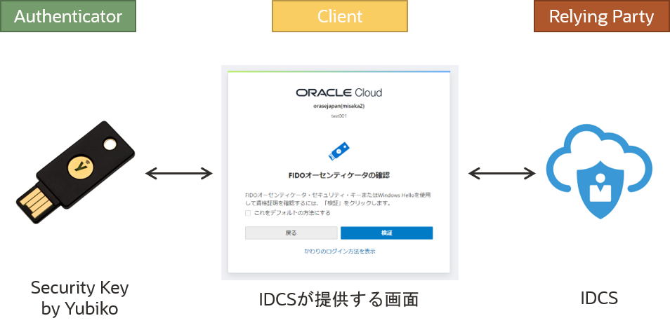
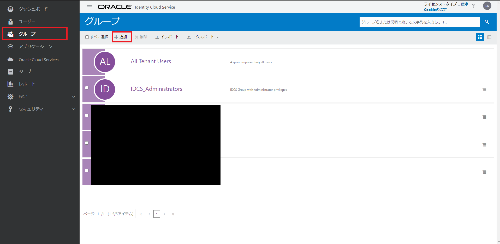
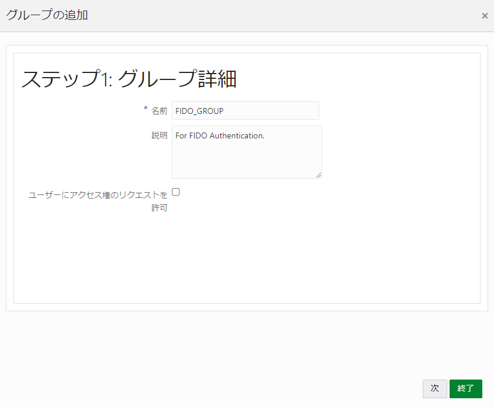
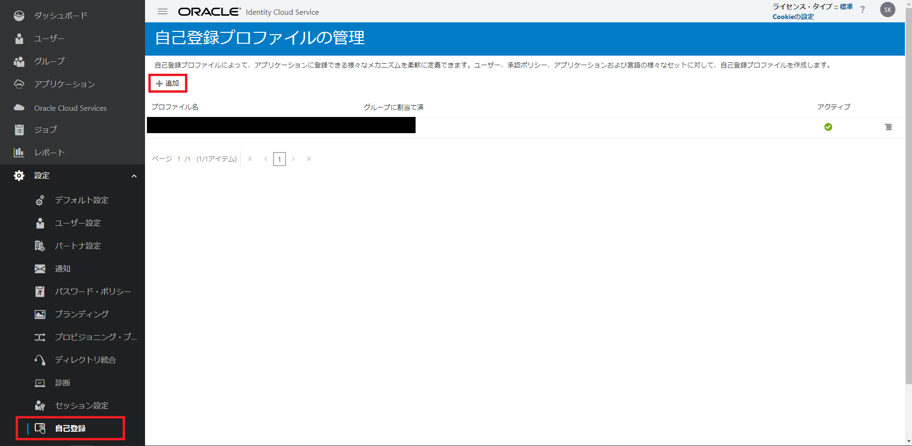
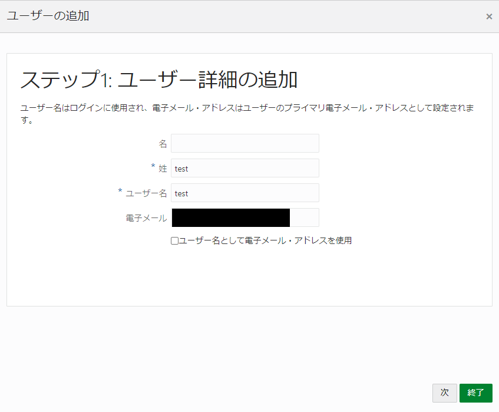
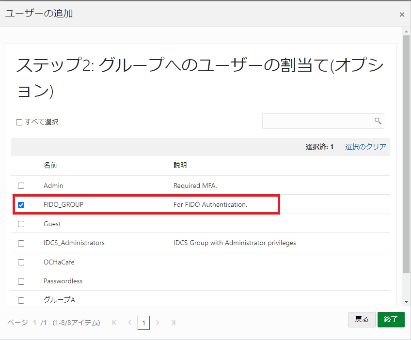
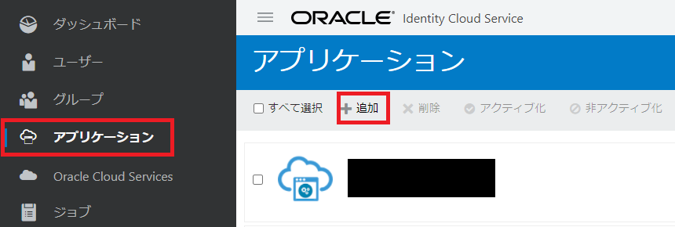

# 始めに

FIDO2 による認証を Oracle の Identity Provider である IDCS(Oracle Identity Provider Service)を使ってさくっと作ってみます。IDCS は、Always Free でも触ることができるので是非試してみてください！

# 環境



構成図にも記載していますが、今回は

- Authenticator: Yubikey
- Client: IDCS 提供の画面 + α(認証成功後にリダイレクトされる画面等)
- Relying Party: Oracle Identity Cloud Service

という構成となっています。手元に認証器がない方は、Chrome の拡張の [Virtual Authenticators Tab](https://github.com/google/virtual-authenticators-tab) で代用可能です。

# 手順

## IDCS のセットアップ

### Service Request を申請する

OCI 契約時に自動的に含まれている IDCS では、FIDO Authenticator を使用したパスワードレス認証／MFA を使用することができないので、Service Request を申請し、機能の制限を解除してもらう必要があります。  
詳しくはこちらをご参照ください。

[Manage Passwordless Authentication](https://docs.oracle.com/en/cloud/paas/identity-cloud/uaids/manage-passwordless-authentication.html#GUID-2BDA86CF-2733-4335-ACDB-DE13FCD300B4)

### Group を作成する

まずは、登録したユーザーが所属するグループを作成します。  
管理コンソールから、**グループ** > **追加**を押下し、グループを新しく作成します。



作成するグループは以下のよう。



現時点では、ユーザーを所属させる必要はないので、このまま**終了**を押し、グループの作成を完了させます。

### 自己登録プロファイルを作成する

ユーザーのセルフサインアップを行うために、自己登録プロファイルを作成します。  
管理コンソールから、**設定** > **自己登録** > **追加**を押下し、グループを新しく作成します。



以下のように入力し、プロファイルを作成します。



先ほど、作成したグループを割り当てる事で、このプロファイルに基づき登録されたユーザーが作成したグループ(FIDO)に所属するようになります。

### Application を作成する

ID 管理を行う単位であるアプリケーションを作成します。  
管理コンソールから、**アプリケーション** > **追加**を押し、アプリケーションを作成します。



**機密アプリケーション**を選択します。



その後、以下のように入力しアプリケーションを作成します。(記載のない内容については未入力で大丈夫です)

- 詳細
  - 名前: FIDO
- クライアント
  - 許可される権限付与タイプ: クライアント資格証明、JWT アサーション、認可コード
  - HTTPS 以外の URL を許可にチェック
  - リダイレクト URL: `http://localhost/login-success.html`
- リソース

### IdP ポリシーを作成する

アプリケーションに設定する ID 管理のためのポリシー(ユーザーの認証方法 etc.)を設定します。

### サインオンポリシーを作成する

アプリケーションに設定するユーザーの認証時のポリシーを設定します。今回は、

- Username/Password を用いて認証したユーザーに対しては、2 番目の要素として FIDO 認証器による認証を強制する
- FIDO の認証器を用いて認証したユーザーはそのまま認証可能(パスワードレス)

というポリシーを設定したいと思います。

## 認証成功後にリダイレクトされる画面を作成する

簡単な画面を作ったのでこちらをご活用ください。

```bash
git clone https://github.com/shukawam/xxx.git
```

# 終わりに

初めて触る方にとっては、想像したよりも簡単に生体認証を導入することができたのではないでしょうか。今回は、**Identity Provider が FIDO2 の Relying Party を代わりに実装している**形式で試してみましたが、学習がてら自分で実装してみたい方はこちらも参考にしてみてください。

[Helidon MP, WebAuthn4J で FIDO2(WebAuthn)](https://qiita.com/shukawam/items/4c1625bb6ae00e6b17f1)
