+++
title = ""
author = "Shuhei, Kawamura"
date = ""
tags = []
categories = []
draft = "true"
[[images]]
  src = ""
  alt = ""
  stretch = "stretchH"
+++

# 始めに

FIDO2 による認証機能を Oracle の IDaaS である IDCS(Oracle Identity Provider Service)を使ってさくっと作ってみます。尚、本機能は Foundation プラン(OCI のセットアップ時に自動的に付いてくる IDCS のライセンス体系)では試すことができないのでそこだけご了承ください。

# 環境

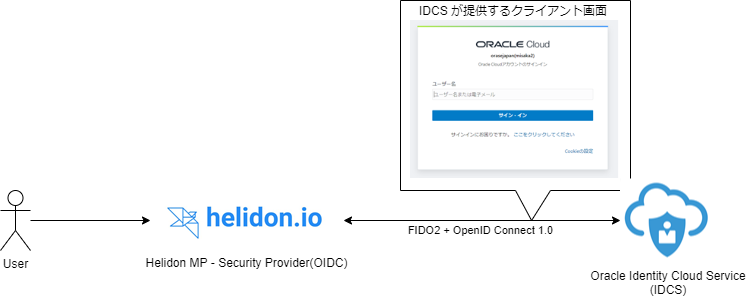

- Authenticator: Yubikey
- Client: IDCS が提供する画面
- Relying Party(FIDO2)/IdP(OIDC): IDCS

という構成でやってみます。手元に何らかの認証器がない方は、Chrome の拡張の [Virtual Authenticators Tab](https://github.com/google/virtual-authenticators-tab) で代用可能です。

# 手順

## IDCS のセットアップ

### Group を作成する

まずは、ユーザーが所属するグループを作成します。  
管理コンソールから、**グループ** > **追加**を押下し、グループを新しく作成します。


作成するグループは以下のよう。


現時点では、ユーザーを所属させる必要はないので、このまま**終了**を押し、グループの作成を完了させます。

### ユーザーの登録

先ほど、作成したグループに所属させるユーザーを適当に作成してください。

### Application を作成する

ID 管理を行う単位であるアプリケーションを作成します。  
管理コンソールから、**アプリケーション** > **追加**を押し、アプリケーションを作成します。


**機密アプリケーション**を選択します。


その後、以下のように入力しアプリケーションを作成します。(記載のない内容については未入力で大丈夫です)

- 詳細
  - 名前: FIDO

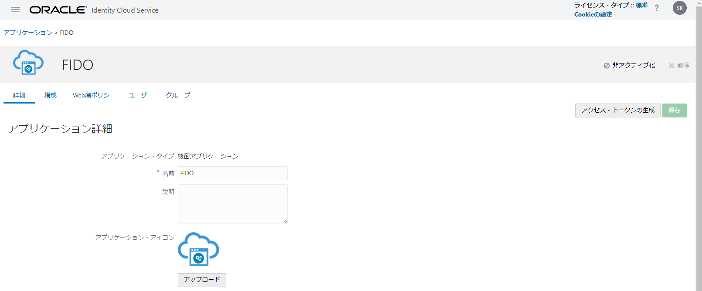

- クライアント
  - 許可される権限付与タイプ: クライアント資格証明、JWT アサーション、リフレッシュトークン、認可コード
  - HTTPS 以外の URL を許可にチェック
  - リダイレクト URL: `http://localhost:7987/oidc/redirect`
  - Identity Cloud Service 管理 API へのクライアント・アクセス権を付与します: Authenticator Client, Me, MFA Client, Signin

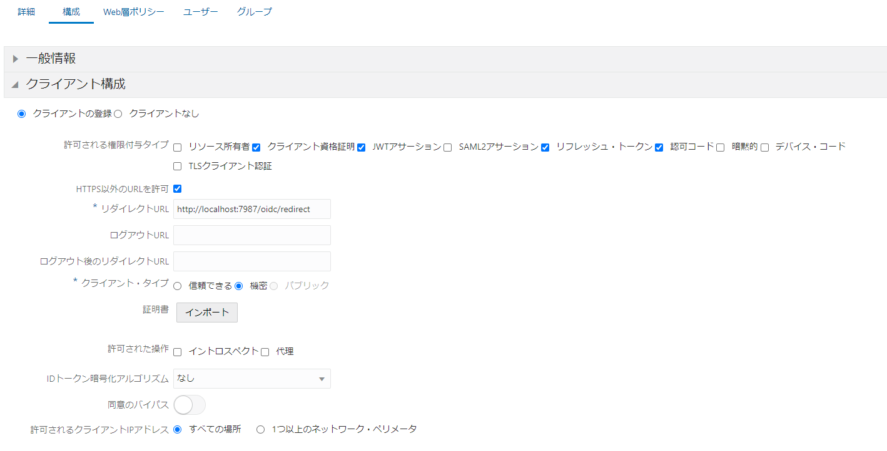

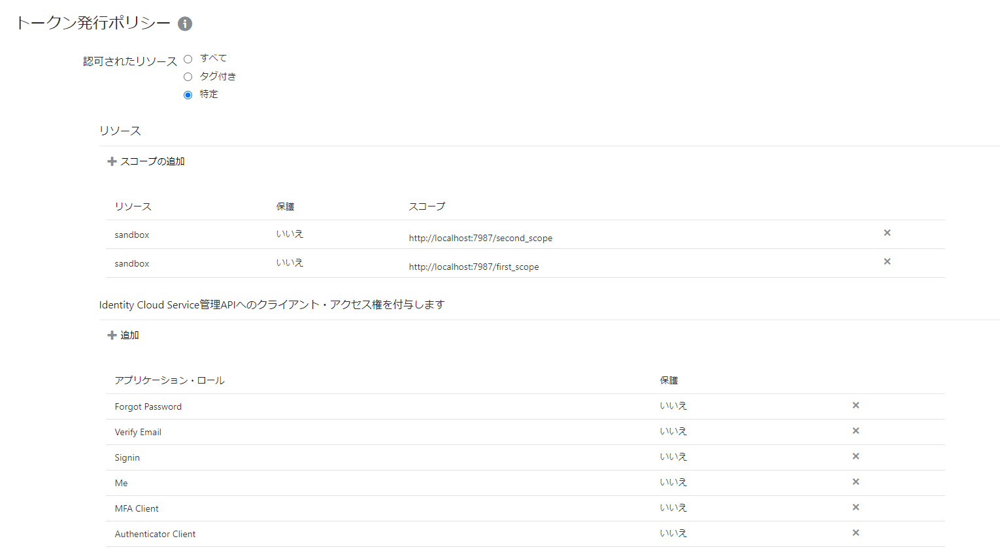

### IDP ポリシーを作成する

アプリケーションに設定する ID 管理のためのポリシー(ユーザーの認証方法 etc.)を設定します。管理コンソールから、**セキュリティ** > **IDP ポリシー** > **追加**を押し、FIDO2 認証のためのポリシーを作成します。

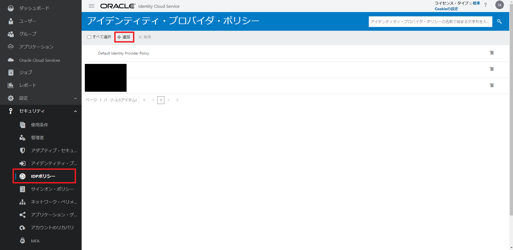

以下のように入力します。

- ポリシー名: FidoPolicy

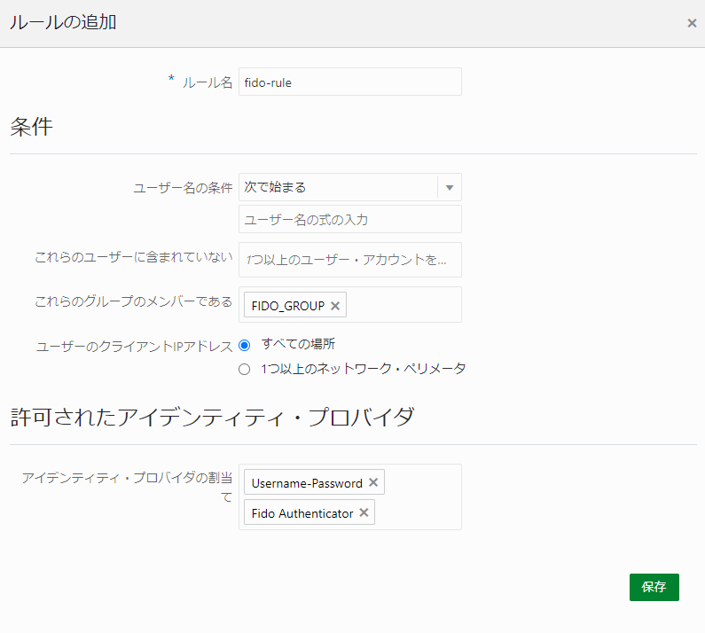

次に実際に適用されるルールの設定をします。

- ルール名: fido
- これらのグループのメンバーである: FIDO(先ほど作成したグループ名を指定する)
- 許可されたアイデンティ・プロバイダ: Username-Password, Fido Authentication

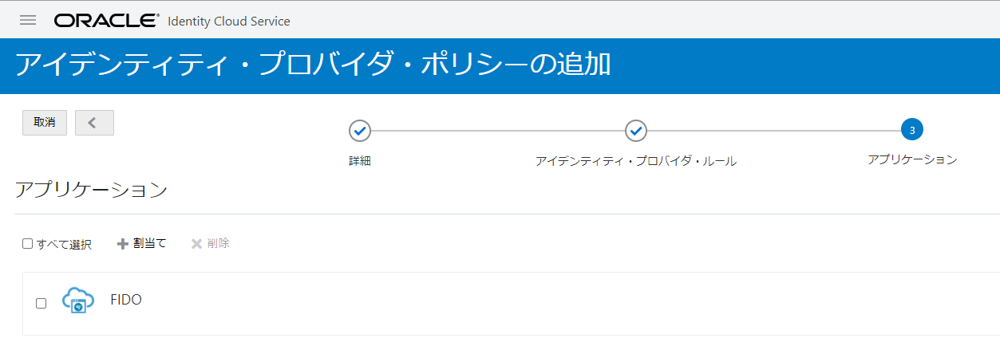

初回の認証器登録の際に、ユーザーの認証が必要なので FIDO 認証以外の認証方法も許可する必要があります。

そして、先ほど作成したアプリケーションを作成した IDP ポリシーに割り当てます。

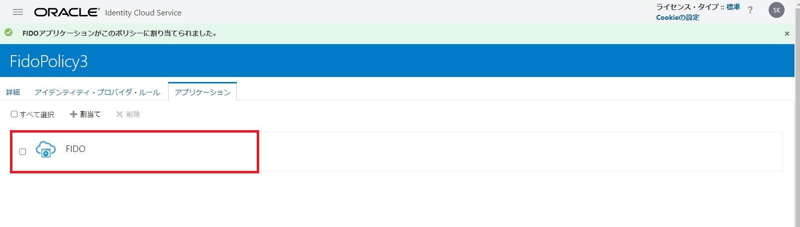

### サインオン・ポリシーを作成する

アプリケーションに設定するユーザーの認証時のポリシーを設定します。今回は、

- Username/Password を用いて認証したユーザーに対しては、2 番目の要素として FIDO 認証器による認証を強制する
- FIDO の認証器を用いて認証したユーザーはそのまま認証可能(パスワードレス)

というポリシーを設定したいと思います。**セキュリティ** > **サインオン・ポリシー** > **追加**を押し、サインオン・ポリシーを追加します。

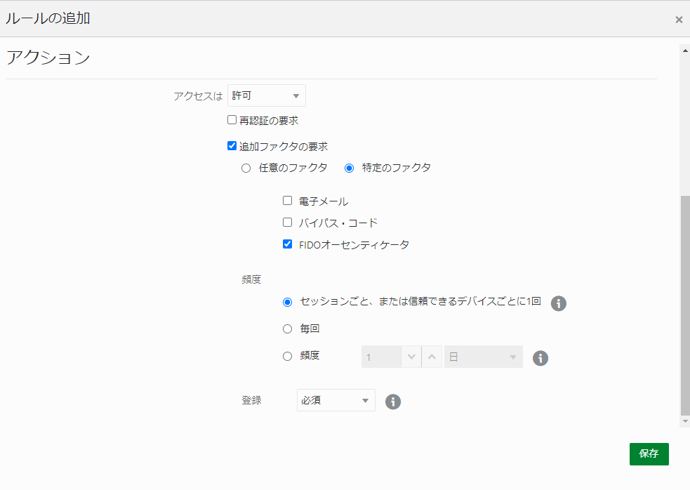

以下のように入力します。

- ポリシー名: FidoPolicy

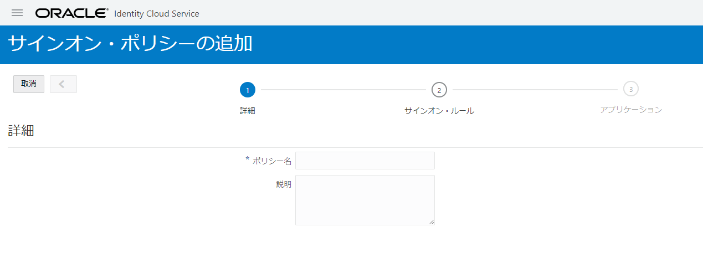

次に適用するポリシーを設定します。

- ルール名: fido
- ユーザーが次によって認証されている場合: Username-Password
  - Fido Authenticator も選択すると認証成功 -> 再度認証の無限ループとなるのでお気を付けください
- ユーザーのクライアント IP アドレス: すべての場所


- アクセス: 許可
- 再認証の要求と追加ファクタの要求にチェック
- 特定のファクタにチェック(FIDO オーセンティケータを選択)
- 登録: 必須

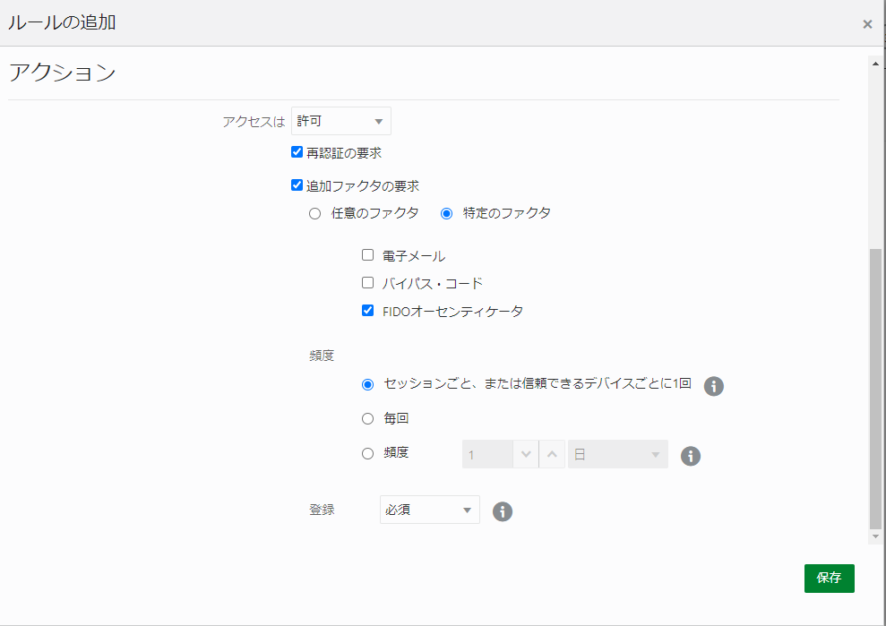

これで、

> - Username/Password を用いて認証したユーザーに対しては、2 番目の要素として FIDO 認証器による認証を強制する
> - FIDO の認証器を用いて認証したユーザーはそのまま認証可能(パスワードレス)

といったポリシーを設定できました。

### セッション設定

FIDO2 によるパスワードレス認証を有効にするため、**設定** > **セッション設定**から**ユーザー名を先に有効化**のフラグを有効化します。

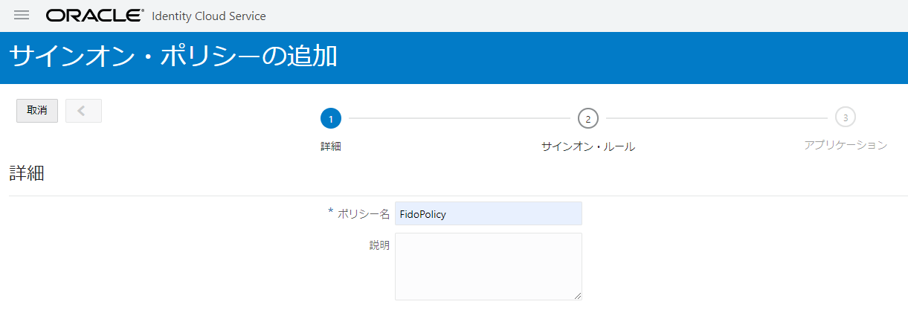

## 認証を行うサーバーサイドアプリケーションを実装する

今回は、Helidon の Security Provider と IDCS を使用してユーザーの認証機能を実装します。詳細部は[リポジトリ](https://github.com/shukawam/fido2-idcs)を参照していただければ幸いです。

### 依存関係を追加

Helidon から各種認証プロトコルに対応するためのプロバイダーが提供されているので、そちらを使用するために以下の依存関係を追加します。

```pom.xml
<dependencies>
  <!-- ... -->
  <dependency>
      <groupId>io.helidon.microprofile</groupId>
      <artifactId>helidon-microprofile-oidc</artifactId>
  </dependency>
  <dependency>
      <groupId>io.helidon.security.providers</groupId>
      <artifactId>helidon-security-providers-idcs-mapper</artifactId>
  </dependency>
</dependencies>
```

### 設定ファイル(`application.yaml`)

Security Provider 用の設定を追加します。ドキュメントだとこの辺りに記載されています。

- [Helidon Security Provider - OIDC プロバイダ](https://oracle-japan-oss-docs.github.io/helidon/docs/v2/#/mp/security/02_providers#_oidc_provider)

```application.yaml
security:
  # Set to true for production - if set to true, clear text passwords will cause failure
  config.require-encryption: false
  properties:
    # Recommend: Override with environment value
    idcs-uri: "https://idcs-....identity.oraclecloud.com" # your idcs tenant uri
    idcs-client-id: "1d..." # your client id
    idcs-client-secret: "78..." # your client secret
    frontend-uri: "http://localhost:7987"
    proxy-host: ""
  providers:
    - abac:
      # Adds ABAC Provider - it does not require any configuration
    - oidc:
        client-id: "${security.properties.idcs-client-id}"
        client-secret: "${security.properties.idcs-client-secret}"
        identity-uri: "${security.properties.idcs-uri}"
        # A prefix used for custom scopes
        scope-audience: "http://localhost:7987"
        proxy-host: "${security.properties.proxy-host}"
        frontend-uri: "${security.properties.frontend-uri}"
        audience: "https://idcs-....identity.oraclecloud.com:443"
        # support for non-public signature JWK (and maybe other IDCS specific handling)
        server-type: "idcs"
        idcs-roles: true
    # IDCSのグループを使用してJAX-RSのエンドポイントに対してRBACを実施する場合は必要となります
    - idcs-role-mapper:
        multitenant: false
        oidc-config:
          # we must repeat IDCS configuration, as in this case
          # IDCS serves both as open ID connect authenticator and
          # as a role mapper. Using minimal configuration here
          client-id: "${security.properties.idcs-client-id}"
          client-secret: "${security.properties.idcs-client-secret}"
          identity-uri: "${security.properties.idcs-uri}"
```

### ログイン処理を行うためのエンドポイントを作成する

```AuthResource.java
import io.helidon.security.SecurityContext;
import io.helidon.security.annotations.Authenticated;

import javax.json.Json;
import javax.json.JsonBuilderFactory;
import javax.json.JsonObject;
import javax.ws.rs.GET;
import javax.ws.rs.Path;
import javax.ws.rs.Produces;
import javax.ws.rs.core.Context;
import javax.ws.rs.core.MediaType;
import java.util.Collections;

@Path("auth")
public class AuthResource {
    private static final JsonBuilderFactory JSON = Json.createBuilderFactory(Collections.emptyMap());

    @GET
    @Path("login")
    @Authenticated // Helidon - Security Providerを使用して認証処理を行うためのアノテーション
    @Produces(MediaType.APPLICATION_JSON)
    public JsonObject login(@Context SecurityContext securityContext) {
        var message = String.format("Hello %s!", securityContext.userName());
        return JSON.createObjectBuilder()
                .add("message", message)
                .build();
    }
}
```

# おまけ

# 終わりに

初めて触る方にとっては、想像したよりも簡単に FIDO 認証を導入することができたのではないでしょうか。今回は、**Identity Provider が FIDO2 の Relying Party を代わりに実装している**形式で試してみましたが、学習がてら自分で実装してみたい方はこちらも参考にしてみてください。

[Helidon MP, WebAuthn4J で FIDO2(WebAuthn)](https://qiita.com/shukawam/items/4c1625bb6ae00e6b17f1)
