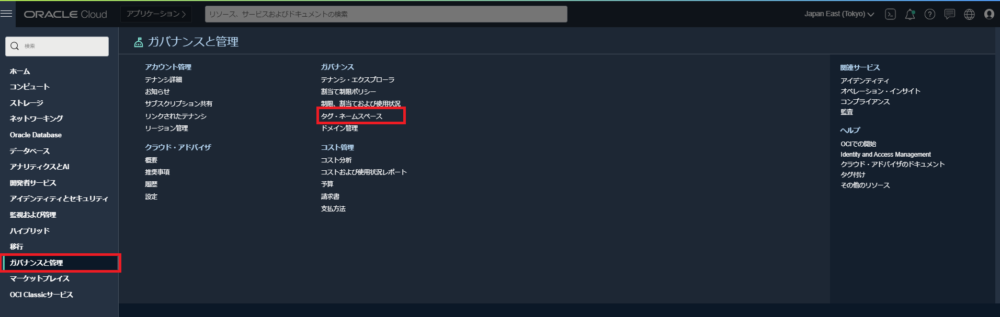
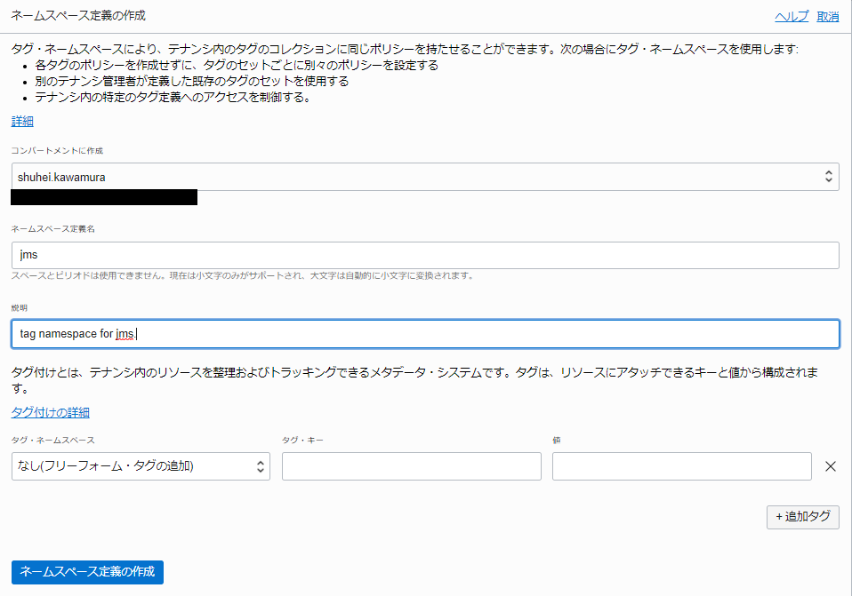
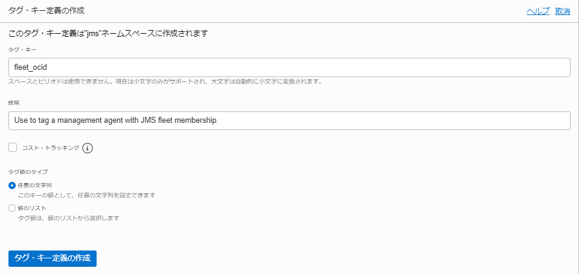
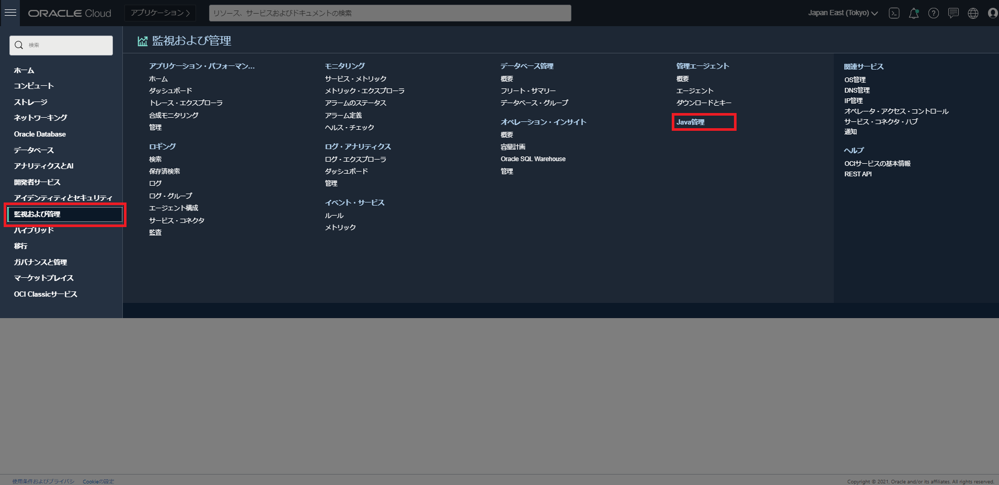
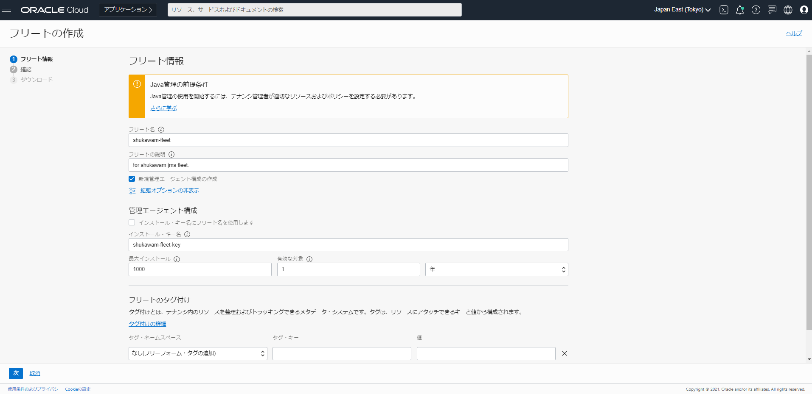
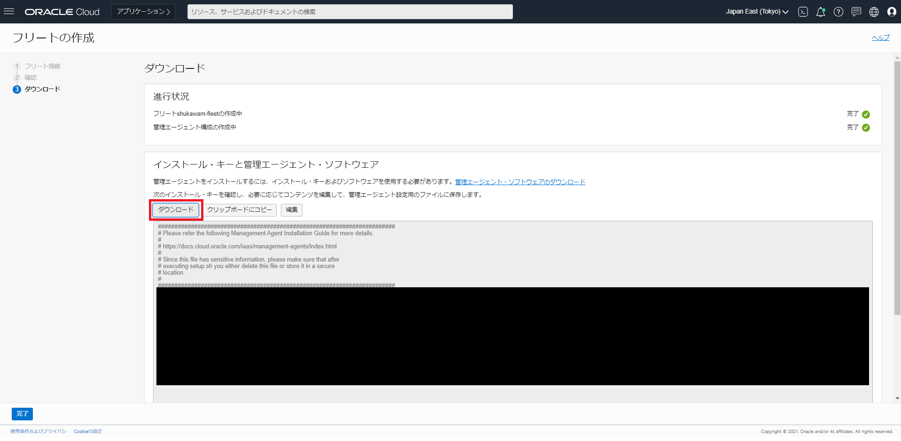
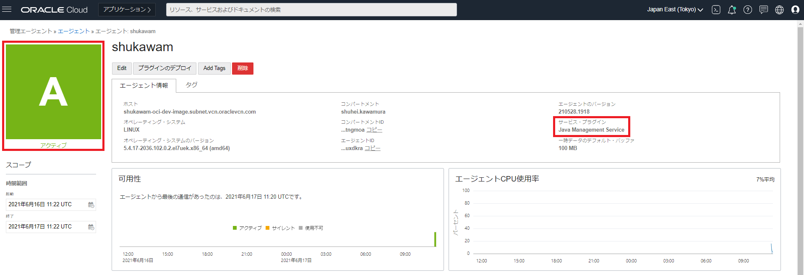
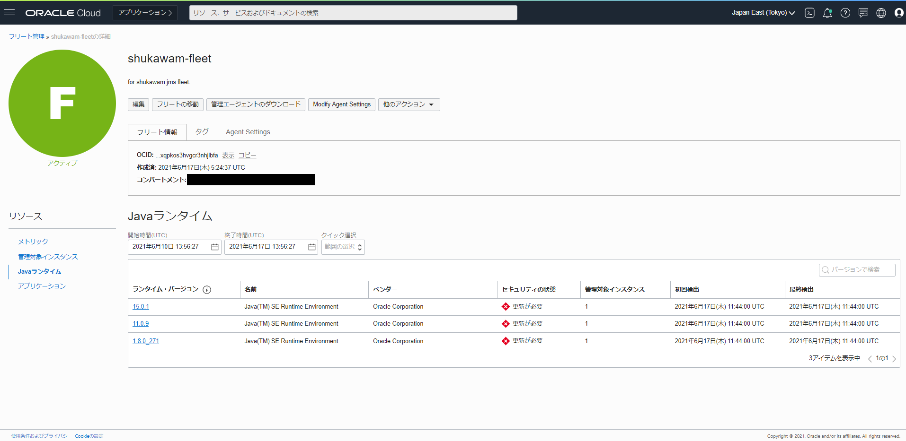

+++
title = ""
author = "Shuhei, Kawamura"
date = ""
tags = []
categories = []
draft = "true"
+++

# 始めに

6/9 に OCI で Java Management Service (JMS) というものが GA されました。今回は、JMS の簡単な説明と実際にインスタンスにエージェントをインストールし、監視ができるところまでを書きたいと思います。何とも Java Message Service と混同しそうな名前ですが、本記事で JMS と表記した場合は全て Java Management Service を差しています。

# What's JMS ?

ドキュメントは [OCI - Java Management](https://docs.oracle.com/en-us/iaas/jms/index.html) にありますが、英語だし長くて読めないよって方はこちらを見るだけでも大分雰囲気はつかめると思います。

- 各種環境にエージェントをインストールし、その環境で実行されている Java(JDK/JRE/GraalVM) の使用状況を監視する
- JMS は Java SE のサブスクリプションに含まれている機能
  - 環境にインストールされている Java のバージョン情報だけであれば、Oracle Java に限らず取得可能
  - Oracle Java の場合は、バージョン情報に加えそれが依存しているアプリケーションの数まで取得可能

また、GA された際のブログの翻訳記事が公開されているので、合わせてご参照ください。

- [Java Management Service のリリース](https://blogs.oracle.com/oracle4engineer/oci-jms-ga)

# 手順

使い方は結構簡単です。まずは、JMS に依らない管理エージェントサービスを使用するための準備をします。

> - Step 1: Create or designate compartment(s) to use
> - Step 2: Create a user group
> - Step 3: Create policies for user group
> - Step 4: Create a dynamic group of all agents
> - Step 5: Create policies for agent communication

Step1, 2 のコンパートメント、グループの作成は省略します。必要な方は、[Perform Prerequisites for Deploying Management Agents](https://docs.oracle.com/en-us/iaas/management-agents/doc/perform-prerequisites-deploying-management-agents.html) を参照し適宜作成してください。

## 事前準備

### OCI Requirement

#### Step 3: ポリシーの作成

作成した／作成済みのグループに対して、ポリシーをアタッチします。具体的には以下のポリシーです。

```txt
# required
Allow group <your-group> to manage management-agents in compartment <your-compartment>
# required
Allow group <your-group> to manage management-agent-install-keys in compartment
# required
Allow group <your-group> to read metrics in compartment <your-compartment>
# optional
Allow group <your-group> to read users in tenancy
```

※`<your-group>`, `<your-compartment>`は適宜自分の環境に置き換えてください。

#### Step 4, 5: 動的グループとポリシーの作成

デフォルトでは、管理エージェントは OCI リソースと通信することができないのでそれを許可するための動的グループとそれにアタッチするポリシーを作成します。

動的グループ；

```txt
ALL {resource.type='managementagent', resource.compartment.id='<your-compartment-id>'}
```

※コンパートメント ID は、**OCI Console** > **アイデンティティ** > **コンパートメント**から確認することができます。

ポリシー；

```txt
# required
Allow dynamic-group <your-dynamic-group> to manage management-agents in compartment <your-compartment>
# required
Allow dynamic-group <your-dynamic-group> to use metrics in compartment <your-compartment>
# optional (ダウンロードしたインストールキーをそのまま使いたい場合は必須です)
Allow dynamic-group <your-dynamic-group> to use tag-namespaces in compartment <your-compartment>
```

※`<your-dynamic-group>`, `<your-compartment>`は適宜自分の環境に置き換えてください。

### Other Requirement

一応、[OS, N/W 辺りの要件](https://docs.oracle.com/en-us/iaas/management-agents/doc/perform-prerequisites-deploying-management-agents.html#OCIAG-GUID-BC5862F0-3E68-4096-B18E-C4462BC76271)も定義してありますが本記事では省略します。

### Getting Started with JMS

一応、ドキュメントでは以下のような手順で紹介されていますが、3, 4, 7, 9 以外は省略します。(先ほどの事前準備と重複したり、最低限の動作に不要な手順のため)

> 1. Sign in to Oracle Cloud Infrastructure.
> 2. Create a compartment for your JMS resources.
> 3. Create a new tag namespace.
> 4. Create a new tag key.
> 5. Create a user group for your JMS users.
> 6. Create one or more user accounts for your JMS users.
> 7. Create policies for your user group to access and manage JMS fleets, management agents and agent install keys.
> 8. Create a dynamic group of all agents.
> 9. Create policies for agent communication.

#### Step 3: タグ・ネームスペースを作成する

Tag Namespace は、OCI Console > **ガバナンスと管理** > **タグ・ネームスペース**と辿ると確認することができます。



**ネームスペースの作成**を押し、以下のように入力しタグ・ネームスペースを作成します。

- コンパートメントに作成: 作成済みのコンパートメントを指定
- ネームスペース定義名: jms
- 説明: tag namespace for jms.



#### Step4: タグのキーを作成する

作成したネームスペースを押し、**タグ・キー定義の作成**を押し、以下のように入力します。

- タグ・キー: fleet_ocid
- 説明: Use to tag a management agent with JMS fleet membership.



#### Step 7: グループにポリシーをアタッチする

事前作成済みのグループ(もしくは事前準備で作成したグループ)に対して、JMS の Fleet[^1]を管理するためのポリシーをアタッチします。(ドキュメントでは、管理エージェントや鍵に対するポリシーをアタッチしていますが、事前準備を実施した場合は重複するため不要です)

[^1]: 管理エージェントの集合単位

```txt
Allow group <your-group> to manage fleet in compartment <your-compartment>
```

※`<your-group>`, `<your-compartment>`は適宜自分の環境に置き換えてください。

これで事前準備は完了です。

#### Step 9: 動的グループにポリシーをアタッチする

管理エージェントが通信するためのポリシーを動的グループにアタッチします。

```txt
Allow dynamic-group<your-dynamic-group> to use metrics in compartment <your-compartment>
```

## JMS Fleet の作成

ちょっと分かりづらい場所になりますが、JMS Fleet は下図から作成できます。



**フリートの作成**を押し作成するために必要な情報を入力します。



一通り入力が完了すると、管理エージェントのインストールに必要なインストールキーがダウンロードできるようになるのでダウンロードしておきます。



これで管理エージェントをインストールする準備が整いました！

## 管理エージェントのインストール

以下 OCI CLI が問題なく使えることを前提に書きます。

まずは、エージェントの格納先を確認します。

```bash
# 都合上環境変数に設定しておく
COMPARTMENT_ID = <your-compartment-id>
oci management-agent agent-image list -c $COMPARTMENT_ID
{
  "data": [
    {
      "checksum": "2d39f5728ca742dc99c226204b3ea216a8e3ae04a4388343f96684e8c177d703",
      "id": "ocid1.managementagentimage.oc1..aaaaaaaascnxvspd3ytsuezcxzqtxq6lzl7m7p2psjmdd37fqa5tn3az43tq",
      "lifecycle-state": "ACTIVE",
      "object-url": "https://objectstorage.ap-tokyo-1.oraclecloud.com/n/idtskf8cjzhp/b/installer/o/Windows-x86_64/latest/oracle_mgmt_agent.zip",
      "platform-name": "Windows-x86_64",
      "platform-type": "WINDOWS",
      "size": 42513486.0,
      "version": "210528.1918"
    },
    {
      "checksum": "5ad1ad1506ebe1aa9e5e12a5e9a4d9055779b77250b73f17e52c2fa4c2698e86",
      "id": "ocid1.managementagentimage.oc1..aaaaaaaab6l6qbyxkmmruvoobpy7a5gzneqgqqv7lkqkqvpd6qemmwsjxwta",
      "lifecycle-state": "ACTIVE",
      "object-url": "https://objectstorage.ap-tokyo-1.oraclecloud.com/n/idtskf8cjzhp/b/installer/o/Linux-x86_64/latest/oracle.mgmt_agent.rpm",
      "platform-name": "Linux-x86_64",
      "platform-type": "LINUX",
      "size": 41971204.0,
      "version": "210528.1918"
    }
  ]
}
```

ダウンロードする。

```bash
wget https://objectstorage.ap-tokyo-1.oraclecloud.com/n/idtskf8cjzhp/b/installer/o/Linux-x86_64/latest/oracle.mgmt_agent.rpm
--2021-06-17 06:27:33--  https://objectstorage.ap-tokyo-1.oraclecloud.com/n/idtskf8cjzhp/b/installer/o/Linux-x86_64/latest/oracle.mgmt_agent.rpm
Resolving objectstorage.ap-tokyo-1.oraclecloud.com (objectstorage.ap-tokyo-1.oraclecloud.com)... 134.70.80.3
Connecting to objectstorage.ap-tokyo-1.oraclecloud.com (objectstorage.ap-tokyo-1.oraclecloud.com)|134.70.80.3|:443... connected.
HTTP request sent, awaiting response... 200 OK
Length: 41971204 (40M) [application/octet-stream]
Saving to: ‘oracle.mgmt_agent.rpm’

100%[=================================================================================================================================================================================================================>] 41,971,204  93.3MB/s   in 0.4s

2021-06-17 06:27:34 (93.3 MB/s) - ‘oracle.mgmt_agent.rpm’ saved [41971204/41971204]
```

インストールする。(Java のバージョンは 8 しか対応していないらしいのでご注意ください)

```bash
sudo rpm -ivh oracle.mgmt_agent.rpm
Preparing...                          ################################# [100%]
Checking pre-requisites
        Checking if any previous agent service exists
        Checking if OS has systemd or initd
        Checking available disk space for agent install
        Checking if /opt/oracle/mgmt_agent directory exists
        Checking if 'mgmt_agent' user exists
        Checking Java version
                JAVA_HOME is not set or not readable to root
                Trying default path /usr/bin/java
                Java version: 1.8.0_271 found at /usr/bin/java
        Checking agent version
Updating / installing...
   1:oracle.mgmt_agent-210528.1918-1  ################################# [100%]

Executing install
        Unpacking software zip
        Copying files to destination dir (/opt/oracle/mgmt_agent)
        Initializing software from template
        Creating 'mgmt_agent' daemon
        Agent Install Logs: /opt/oracle/mgmt_agent/installer-logs/installer.log.0

        Setup agent using input response file (run as any user with 'sudo' privileges)
        Usage:
                sudo /opt/oracle/mgmt_agent/agent_inst/bin/setup.sh opts=[FULL_PATH_TO_INPUT.RSP]

Agent install successful
```

次にエージェントのセットアップに必要な Response File を作成します。`mgmt_agent`ユーザーが読み取り可能な場所(`/tmp`とか？)に `input.rsp` を作成し先ほどダウンロードしたインストールキーの内容を貼り付けます。

```input.rsp
########################################################################
# Please refer the following Management Agent Installation Guide for more details.
#
# https://docs.cloud.oracle.com/iaas/management-agents/index.html
#
# Since this file has sensitive information, please make sure that after
# executing setup.sh you either delete this file or store it in a secure
# location.
#
########################################################################
ManagementAgentInstallKey = Mi4wLGFwLXRva3lvLT...
AgentDisplayName = shukawam
#Please uncomment the below tags properties and provide values as needed
#FreeFormTags = [{"<key1>":"<value1>"}, {"<key2>":"<value2>"}]
DefinedTags = [{"jms":{"fleet_ocid":"ocid1.jmsfleet.oc1.ap-tokyo-1.amaaa..."}}]
ProxyHost =
ProxyPort =
ProxyUser =
ProxyPassword =
ProxyRealm =
CredentialWalletPassword = ChangeMeN0w! # 変更する
Service.plugin.jms.download=true
```

保存後に`input.rsp`のパーミッションを確認し、全ユーザーに対して読み取りが可能が可能であることを確認します。作成した Response File を用いて初期設定を行います。

```bash
sudo /opt/oracle/mgmt_agent/agent_inst/bin/setup.sh opts=/tmp/input.rsp

Executing configure

        Parsing input response file
        Validating install key
        Generating communication wallet
        Generating security artifacts
        Registering Management Agent
                Found service plugin(s): [jms]

Starting agent...
Agent started successfully

Starting service plugin deployment for: [jms]
Deploying service plugin(s)...Done.
        jms : Successfully deployed service plugin

Agent setup completed and the agent is running.
In the future agent can be started by directly running: sudo systemctl start mgmt_agent

Please make sure that you delete /tmp/input.rsp or store it in secure location.
```

何やら上手くいってそうなメッセージは出力されていますが、一応 OCI Console からも確認します。**監視および管理** > **エージェント**と押し、

- ステータスがアクティブなこと
- サービス・プラグインに`Java Management Service`がデプロイされていること

が確認できればエージェントのインストールおよび、初期設定は完了です。



## (おまけ)

今回は、マーケットプレイスから作成できる Developer Image (開発に必要な言語やツールがある程度バンドルされているイメージ)を監視してみましたが、こんな結果になりました。



# 終わりに

今回は、6/9 に GA となった Java Management Service (JMS) の簡単な紹介と実際にインスタンスにインストールして監視結果を見るところまでやってみましたが、

- システム公開前の稟議のエビデンスとして活用する
- Java デプロイメントを企業全体で一括管理する
- etc.

と他にも色々活用できる所がありそうです。

補足となりますが、JMS は Java SE のサブスクリプションに含まれているため、追加のサブスクリプション費用は発生しませんが、OCI Monitoring の無料枠を超えた場合はその分の課金が発生するのでご注意ください。

# 参考

- [OCI - Java Management](https://docs.oracle.com/en-us/iaas/jms/index.html)
- [Java Management Service のリリース](https://blogs.oracle.com/oracle4engineer/oci-jms-ga)
